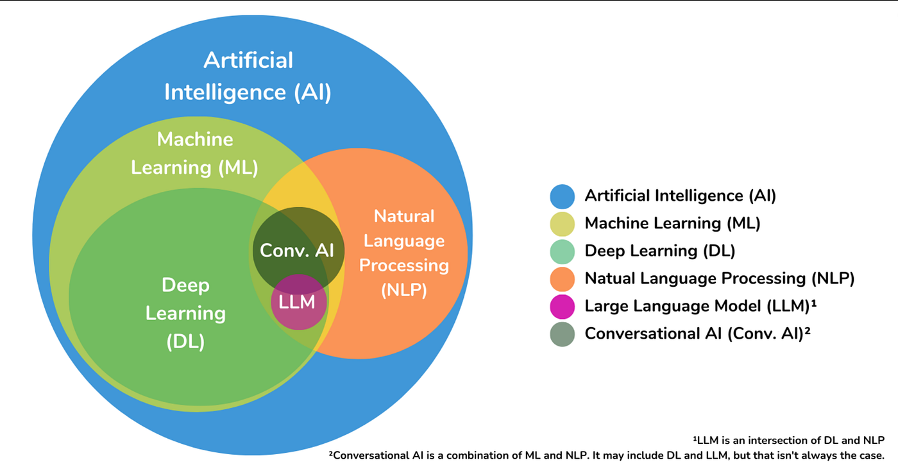
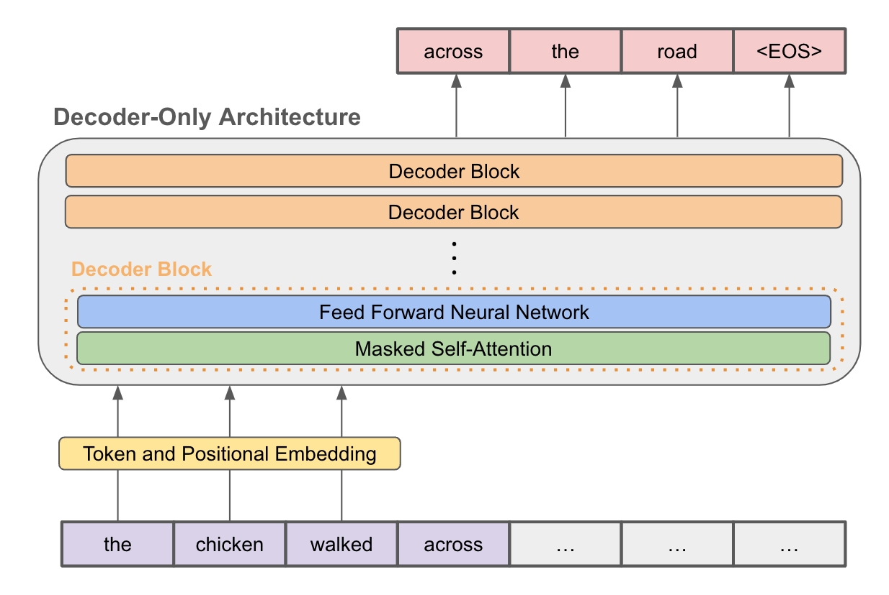
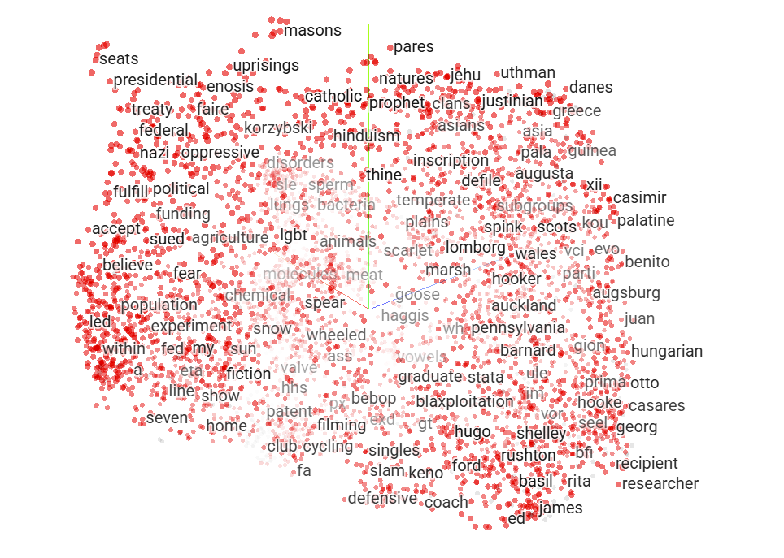
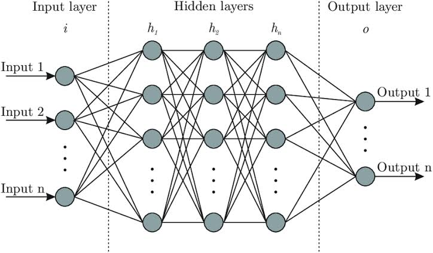

*This README covers all the concepts explanations about Call me maybe and AI in general made by Acherifi*
# call-me-maybe

## Description
Call me maybe is a project about function calling with LLMs, the goal of it is to convert a natural language prompt into a structured function call.
the project focuses on constrained decoding, so the output format stays valid and predictable with clean function name and arguments.

---

## Concepts to clear the dust off

  

### Machine Learning (ML)

Machine learning is a statistical learning algorithms. Focuses on mathematical formulas, logic trees, and statistical probability to find patterns in data. \
instead of writing code for each scenario could happen, developers feed the machine with a lot of data and let the algorithms find the rules on their own.

**Common Uses:**
- Filtering spam out of your email inbox.
- Recommending videos or products based on your past behavior.

### Deep learning (DL)

Deep learning is a specific type of machine learning, designed to handle and manage highly complex, unstructured data (images, audios, etc), based on a Neural Network Architecte. \
And also we can say Deep Learningis made up of many different neural network architectures like (CNNs, RNNs, Transformers, etc).

**Common Uses:**
 - Facial recognition systems on smartphones.
 - Transcribing spoken words into text (speech-to-text).
 - Enabling self-driving cars to differentiate between a pedestrian, a stop sign, and another vehicle.

### Natural Language Processing (NLP)

NLP is a lot of Algorithms that relies on mathematical and linguistic tools to let a machine to understand and generate human language (both text and speech). NLP is a broad field of AI, it uses ML and DL so we can achieve our needs to let the machine understand a human language.

### Large Language Models (LLMs)

LLM is a Model type of deep learning, designed strictly to handle human language, or also we can say LLM is a machine that trained to understand and process human language by using a highly advanced NLP tool, LLMs are buitl on neural netwrok type called "Transformer".

At its core, an LLM is a highly advanced pattern matcher that predicts the next most likely word (or piece of a word, called a token) in a sequence. By understanding the mathematical relationships between words, and it can process, translate, and generate human-like text.

## Transformer in LLMs

  

The Decoder-Only Transformer is the engine under the hood of almost all modern Large Language Models (like GPT-4, Llama 3, and Claude).

When the original Transformer architecture was invented by Google in 2017, it had two halves: an Encoder (to read and understand text) and a Decoder (to generate text). It was built this way because it was originally designed for translating languages.

However, researchers soon realized that if your only goal is to predict the next word in a sequence, you can throw away the Encoder entirely. A Decoder-Only Transformer is simply a streamlined, hyper-optimized text-generation engine.

## Inside of this LLM:

### Token Embedding:

  

its the first step before the neural network, here the input get splited into tokens, and give 
each token its own id and its own static vector.

### Neural Network (transformer):

  

**Positional encoding:** \
Transformers process all tokens at the same time and give each token its own position
cause model needs a way to know the order of the words

**The Decoder Blocks:** \
decoder block represent each layer of hidden layers inside the model, so a model like 
gpt-3 has 96 hidden layers, each layer of those called decoder block. (Qwen 0.6B has 28 hidden layer).
The architecture stacks dozens of identical "Decoder Blocks" on top of each other. Each block contains:

- *Multi-Head, Self-Attention:* \
Those are mechanism that serve the exact same goal: to figure out what a word means by looking 
at the other words around it (understanding the context).

- *Attention masked:* \
its job is to mask the future tokens so the current token can see only the previous tokens, and this applies
in both modes training and inference, but in the inference mode it do not really have future tokens already generated yet
so typically it can't see the future tokens cause there is none yet, but its still get implemented as a safeguard.

- *Feed-Forward Network (FFN):* \
After tokens gather context from each other via attention, they pass through an FFN (often using a modern activation function
like SwiGLU). This acts as the "thinking" phase, applying non-linear transformations to process what was just learned.

- *The Output Head:* \
Once the data passes through all the decoder blocks, a final layer converts the heavily processed vectors back into a list of 
probabilities across the entire vocabulary using softmax, scoring which token is most likely to come next.

### Example
At runtime, the model operates in a continuous loop called autoregressive generation.

**Input:** You feed it a prompt ("The sky is").

**Process:** It tokenizes the prompt, passes it through the stack of decoder blocks, and calculates the probability of the next word.

**Predict:** It picks the highest probability word ("blue").

**Append:** It adds "blue" to your original prompt, making the new input "The sky is blue".

**Repeat:** It runs the entire massive calculation all over again to predict the word after "blue".
It repeats this cycle over and over, generating exactly one token at a time, until it predicts a special token called <EOS>.

## Constrained Decoding
You can just by your prompt control what the llm can generate, but this is not enough, and also you are not 100% sure that the llm will generate your expected output. \
and in here we use something called Constrained Decoding, and its a way the you **force** the llm to generate your **expected output**. 
And with that we use some primary concepts like:

**Proactive Masking (Pre-filtering):** \
its the standard way that we use in constrained decoding, is by creating **your valid vocab** and then **mask all the llm vocab** to *-infinite* except your vocab, so then the llm only can choose next token from your vocab only.

**Reactive Filtering (Speculative / Backtracking Correction):** \
This is the approach where you let **the model choose first**, and then check if it is valid, if not you **mask this token id** to *-infinite*, and get other next token and check it again and so on.

*(The first approach is the standard and the recommended one)*